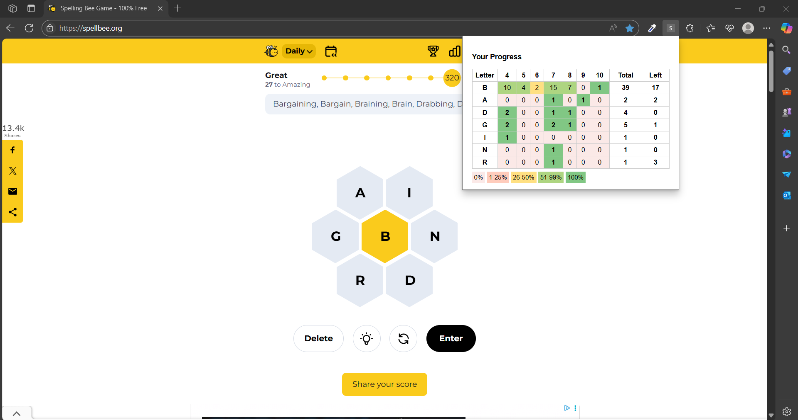

# 🐝 Spelling Bee Word Tracker 

**Spelling Bee Word Tracker** is a Chrome extension that enhances your experience on [spellbee.org](https://spellbee.org) by tracking your guessed words and visualizing your progress using a heatmap.

---

## 🚀 Features

✅ Real-time tracking of guessed words by:
- Word **length** (4–10 letters)  
- **Starting letter** from the daily hexagon

✅ Color-coded **heatmap** showing your progress:
- 🔴 0% guessed
- 🟠 1–25%
- 🟡 26–50%
- 🟢 51–99%
- ✅ 100%

✅ **Left** column to show how many words are left for each letter

✅ Progress table with:
- All hex letters
- Word length distribution
- Totals & remaining guesses
- Helpful tooltips (e.g., `4 of 13`)

✅ Automatically updates as you play  
✅ Lightweight and fast – no extra permissions needed

---

## 📸 Preview

 

---

## 📦 Installation (Local Development)

1. Clone or download this repository  
2. Open `chrome://extensions/` in Chrome  
3. Enable **Developer Mode** 
4. Click **"Load unpacked"**  
5. Select the extension folder 

> 🎯 Make sure all files are in place:  
> `manifest.json`, `popup.html`, `popup.js`, `content.js`, `background.js`

---

## 🧠 How It Works

- `content.js`: Injected into the Spelling Bee page. Tracks guessed words and extracts the hints table.
- `background.js`: Stores the word counts and hint data in `chrome.storage.local`.
- `popup.html` + `popup.js`: Display the live table and heatmap when you click the extension icon.

---

## 🛡 Permissions

- `storage`: Used to persist your progress
- `https://spellbee.org/*`: Extension only activates on the Spelling Bee website

No trackers. No data collection. Fully offline.

---

## 🛠 Developer Notes

- Uses `MutationObserver` to monitor guessed words
- Fully compatible with **Manifest v3**
- Easily extensible (e.g., export to CSV, percent view toggle, streak tracking)

---

